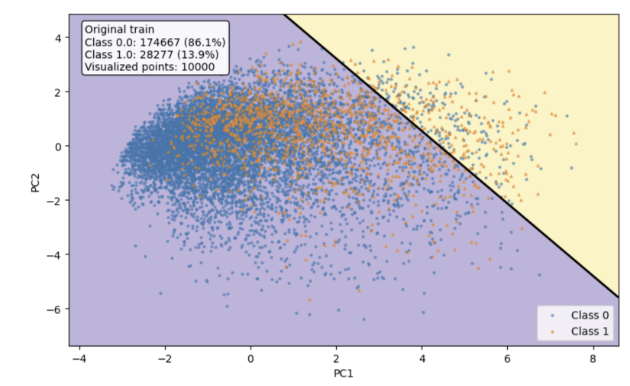
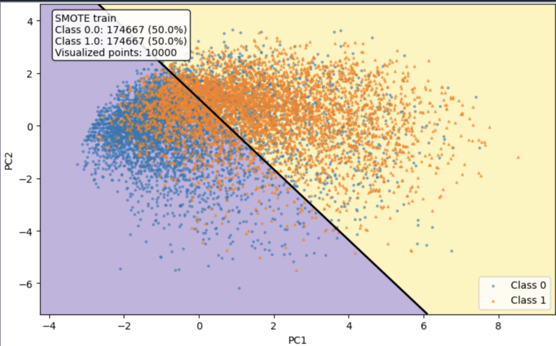

# Understanding Resampling Effects on Decision Boundaries for Imbalanced Diabetes Prediction

**Authors**: Duong Tan Hung, Le Nguyen Trung Dung, Bui Huu Quoc Ngoc, Luong Vuong Nguyen  
**Institute**: Faculty of Artificial Intelligence, FPT University, Danang, Vietnam

---

## 📖 Abstract

Class imbalance poses a significant challenge in medical machine learning, as models trained on skewed data may achieve high accuracy while failing to detect clinically important minority cases. This issue is particularly critical in diabetes screening, where the diabetic class is both underrepresented and clinically consequential. Additionally, survey-based health data introduces class overlap, making the decision boundary difficult to learn. 

This study examines whether improved performance in imbalanced diabetes prediction is driven by increasing minority-class samples or by reducing boundary ambiguity. Using the BRFSS Diabetes Health Indicators dataset, we develop a leakage-aware pipeline with stratified splitting, training-only preprocessing, BMI outlier capping (IQR), feature scaling, resampling optimization, model training, and held-out evaluation. We compare oversampling (SMOTE, ADASYN), undersampling (ENN, Tomek Links, One-Sided Selection), and hybrid methods (SMOTEENN, ADASYN+ENN, ADASYN+Tomek). 

Results show that **ENN** with Gradient Boosting and CatBoost achieves the best F1-score (0.466), while **ADASYN+ENN** yields the highest recall (0.833). Overall, boundary-refinement methods provide a superior balance between precision and recall, whereas adaptive oversampling improves sensitivity at the cost of increased false positives.

---

## 📂 Repository Structure

The repository code is organized based on the resampling strategies used:

```text
.
├── upsampling/
│   ├── method_smote.py
│   └── method_adasyn.py
├── downsampling/
│   ├── method_enn.py
│   ├── method_tomek.py
│   └── method_oss.py
├── hybrid_sampling/
│   ├── method_smote_enn.py
│   ├── method_adasyn_enn.py
│   └── method_adasyn_tomek.py
├── utils.py
├── class_distribution.png
├── original_imbalance_boundary.png
└── README.md
```

---

## 📊 Exploratory Data Analysis

### Class Distribution Analysis
The target distribution confirms a strong imbalance, with non-diabetic cases forming the majority class and diabetic cases forming the minority class.


*Figure 1: Class distribution of the target variable. The diabetic class represents only a small proportion of the dataset.*

### Why Imbalance Becomes a Medical Problem
The effect of imbalance can be illustrated through the decision boundary learned from the original data.


*Figure 2: Illustration of logistic regression trained on the original imbalanced data. The decision boundary is biased toward the majority class, causing many minority diabetic cases to fall on the wrong side of the boundary.*

---

## 🏆 Results on the Held-out Test Set

Because the dataset is imbalanced, we emphasize **Recall** and **F1-score** over raw Accuracy.

### 1. Performance on Original Imbalanced Data (Baseline)
Without resampling, several models retain high accuracy but low recall. This indicates a strong bias toward the majority class.

| Model | Accuracy | Precision | Recall | F1-score |
| :--- | :---: | :---: | :---: | :---: |
| Gradient Boosting | 0.865 | 0.548 | 0.169 | 0.258 |
| Logistic Regression | 0.863 | 0.525 | 0.171 | 0.258 |
| Decision Tree | 0.800 | 0.295 | 0.316 | 0.305 |
| Random Forest | 0.854 | 0.447 | 0.192 | 0.268 |
| Gaussian NB | 0.776 | 0.326 | 0.568 | 0.414 |
| CatBoost | 0.864 | 0.542 | 0.167 | 0.255 |
| Linear Discriminant Analysis | 0.861 | 0.502 | 0.208 | 0.294 |
| Linear SVM | 0.864 | 0.588 | 0.078 | 0.138 |

### 2. Upsampling (Oversampling)

#### Performance with SMOTE
SMOTE improves recall by increasing minority coverage.

| Model | Accuracy | Precision | Recall | F1-score |
| :--- | :---: | :---: | :---: | :---: |
| Gradient Boosting | 0.823 | 0.398 | 0.522 | 0.451 |
| Logistic Regression | 0.798 | 0.367 | 0.617 | 0.460 |
| Decision Tree | 0.800 | 0.306 | 0.340 | 0.322 |
| Random Forest | 0.845 | 0.420 | 0.286 | 0.340 |
| Gaussian NB | 0.745 | 0.310 | 0.675 | 0.425 |
| CatBoost | 0.863 | 0.528 | 0.183 | 0.272 |
| Linear Discriminant Analysis | 0.795 | 0.364 | 0.626 | 0.460 |
| Linear SVM | 0.797 | 0.366 | 0.622 | 0.461 |

#### Performance with ADASYN
ADASYN improves recall by allocating more synthetic samples to difficult minority regions.

| Model | Accuracy | Precision | Recall | F1-score |
| :--- | :---: | :---: | :---: | :---: |
| Gradient Boosting | 0.819 | 0.390 | 0.528 | 0.449 |
| Logistic Regression | 0.794 | 0.363 | 0.628 | 0.460 |
| Decision Tree | 0.798 | 0.294 | 0.319 | 0.306 |
| Random Forest | 0.848 | 0.426 | 0.269 | 0.330 |
| Gaussian NB | 0.740 | 0.306 | 0.686 | 0.424 |
| CatBoost | 0.863 | 0.524 | 0.176 | 0.263 |
| Linear Discriminant Analysis | 0.792 | 0.361 | 0.640 | 0.461 |
| Linear SVM | 0.794 | 0.362 | 0.632 | 0.460 |

### 3. Downsampling (Undersampling)

#### Performance with ENN (Best F1-Score 🏆)
ENN improves recall through a different mechanism: it removes ambiguous local samples that make the boundary difficult to learn. **This leads to the best overall F1-score.**

| Model | Accuracy | Precision | Recall | F1-score |
| :--- | :---: | :---: | :---: | :---: |
| Gradient Boosting | 0.796 | 0.367 | 0.640 | **0.466** |
| Logistic Regression | 0.794 | 0.363 | 0.632 | 0.461 |
| Decision Tree | 0.702 | 0.275 | 0.698 | 0.395 |
| Random Forest | 0.768 | 0.332 | 0.661 | 0.442 |
| Gaussian NB | 0.768 | 0.318 | 0.580 | 0.411 |
| CatBoost | 0.793 | 0.364 | 0.648 | **0.466** |
| Linear Discriminant Analysis | 0.790 | 0.356 | 0.623 | 0.453 |
| Linear SVM | 0.797 | 0.365 | 0.619 | 0.459 |

#### Performance with Tomek Links
Tomek Links provide only moderate improvement. They reduce some local overlap, but the cleaning effect is weaker than that of ENN.

| Model | Accuracy | Precision | Recall | F1-score |
| :--- | :---: | :---: | :---: | :---: |
| Gradient Boosting | 0.862 | 0.510 | 0.240 | 0.326 |
| Logistic Regression | 0.861 | 0.503 | 0.232 | 0.317 |
| Decision Tree | 0.796 | 0.305 | 0.363 | 0.331 |
| Random Forest | 0.852 | 0.444 | 0.263 | 0.330 |
| Gaussian NB | 0.770 | 0.320 | 0.579 | 0.412 |
| CatBoost | 0.862 | 0.508 | 0.241 | 0.327 |
| Linear Discriminant Analysis | 0.856 | 0.472 | 0.269 | 0.343 |
| Linear SVM | 0.864 | 0.542 | 0.151 | 0.236 |

#### Performance with One-Sided Selection
OSS changes recall only slightly because it mainly removes redundant majority samples rather than strongly reshaping the minority region.

| Model | Accuracy | Precision | Recall | F1-score |
| :--- | :---: | :---: | :---: | :---: |
| Gradient Boosting | 0.862 | 0.511 | 0.239 | 0.326 |
| Logistic Regression | 0.861 | 0.503 | 0.231 | 0.317 |
| Decision Tree | 0.797 | 0.307 | 0.363 | 0.333 |
| Random Forest | 0.850 | 0.438 | 0.259 | 0.326 |
| Gaussian NB | 0.770 | 0.320 | 0.579 | 0.412 |
| CatBoost | 0.861 | 0.503 | 0.235 | 0.321 |
| Linear Discriminant Analysis | 0.856 | 0.473 | 0.269 | 0.343 |
| Linear SVM | 0.864 | 0.542 | 0.151 | 0.236 |

### 4. Hybrid Sampling

#### Performance with SMOTEENN
SMOTEENN combines minority expansion with subsequent boundary cleaning, producing a strong balance between recall and F1-score.

| Model | Accuracy | Precision | Recall | F1-score |
| :--- | :---: | :---: | :---: | :---: |
| Gradient Boosting | 0.803 | 0.373 | 0.610 | 0.463 |
| Logistic Regression | 0.745 | 0.321 | 0.745 | 0.448 |
| Decision Tree | 0.706 | 0.277 | 0.686 | 0.394 |
| Random Forest | 0.792 | 0.352 | 0.591 | 0.442 |
| Gaussian NB | 0.730 | 0.298 | 0.692 | 0.416 |
| CatBoost | 0.810 | 0.382 | 0.586 | 0.463 |
| Linear Discriminant Analysis | 0.740 | 0.317 | 0.749 | 0.445 |
| Linear SVM | 0.744 | 0.320 | 0.746 | 0.448 |

#### Performance with ADASYN+ENN (Highest Recall 🏆)
ADASYN+ENN yields the highest recall because it first reinforces difficult minority regions and then cleans the resulting boundary. However, this comes with lower precision.

| Model | Accuracy | Precision | Recall | F1-score |
| :--- | :---: | :---: | :---: | :---: |
| Gradient Boosting | 0.753 | 0.327 | 0.727 | 0.451 |
| Logistic Regression | 0.689 | 0.287 | 0.830 | 0.427 |
| Decision Tree | 0.706 | 0.275 | 0.678 | 0.391 |
| Random Forest | 0.770 | 0.332 | 0.641 | 0.437 |
| Gaussian NB | 0.711 | 0.287 | 0.726 | 0.412 |
| CatBoost | 0.804 | 0.374 | 0.609 | 0.464 |
| Linear Discriminant Analysis | 0.684 | 0.283 | **0.831** | 0.423 |
| Linear SVM | 0.687 | 0.286 | **0.833** | 0.426 |

#### Performance with ADASYN+Tomek
ADASYN+Tomek improves recall more than Tomek Links alone, but still remains below the strongest ENN-based approaches in balanced performance.

| Model | Accuracy | Precision | Recall | F1-score |
| :--- | :---: | :---: | :---: | :---: |
| Gradient Boosting | 0.830 | 0.407 | 0.486 | 0.443 |
| Logistic Regression | 0.787 | 0.355 | 0.647 | 0.459 |
| Decision Tree | 0.796 | 0.294 | 0.331 | 0.311 |
| Random Forest | 0.845 | 0.416 | 0.281 | 0.336 |
| Gaussian NB | 0.738 | 0.305 | 0.690 | 0.423 |
| CatBoost | 0.864 | 0.536 | 0.185 | 0.276 |
| Linear Discriminant Analysis | 0.784 | 0.353 | 0.655 | 0.458 |
| Linear SVM | 0.786 | 0.355 | 0.654 | 0.460 |

---

## 🎯 Conclusion
The results show that resampling is essential for this dataset. Without resampling, several classifiers achieved high accuracy but poor recall, meaning that many diabetic cases were missed. Among the evaluated methods:
- **ENN** achieved the best overall F1-score of 0.466, demonstrating the strongest precision-recall trade-off.
- **ADASYN+ENN** achieved the highest recall of 0.833, indicating the most aggressive minority-case detection.

Overall, the findings show that effective imbalance handling depends not only on class rebalancing but also on boundary refinement. For this dataset, reducing local ambiguity is more beneficial for balanced performance than merely increasing minority-class quantity.
